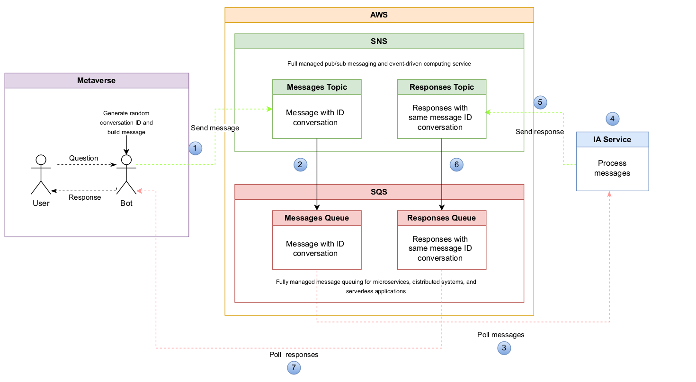

# Conversation API
Real time messages between metaverse and IA bot service with AWS SNS and SQS services.



## Config
The examples are executed in linux environment.

Create the .env file in the root of the project with the following environment variables:
```
AWS_ACCESS_KEY=XXXXXXXX
AWS_SECRET_ACCESS_KEY=XXXXXXXX
AWS_REGION_NAME=XXXXXXXX
MESSAGES_ARN_SNS=XXXXXXXX
MESSAGES_URL_SQS=XXXXXXXX
RESPONSES_ARN_SNS=XXXXXXXX
RESPONSES_URL_SQS=XXXXXXXX
```
With python 3.10 and venv installed, create <b>_env_</b> environment with venv module and activate
```bash
python3.10 -m venv env
source env/bin/activate
```
With the active environment install requirements from pip
```bash
pip install -r requirements.txt
```
## Run
To execute the scripts, ipyhon was used.

#### AI responses polling in metaverse
```python
from apps.metaverse import Metaverse
metaverse = Metaverse()
metaverse.get_responses()
```

#### Metaverse messages polling and response process in IA service
```python
from apps.ia import IAService
ia = IAService()
ia.get_messages()
```

#### Send message to IA service
```python
from apps.metaverse import Metaverse
metaverse = Metaverse()
metaverse.send_message('Hi IA!')
```


